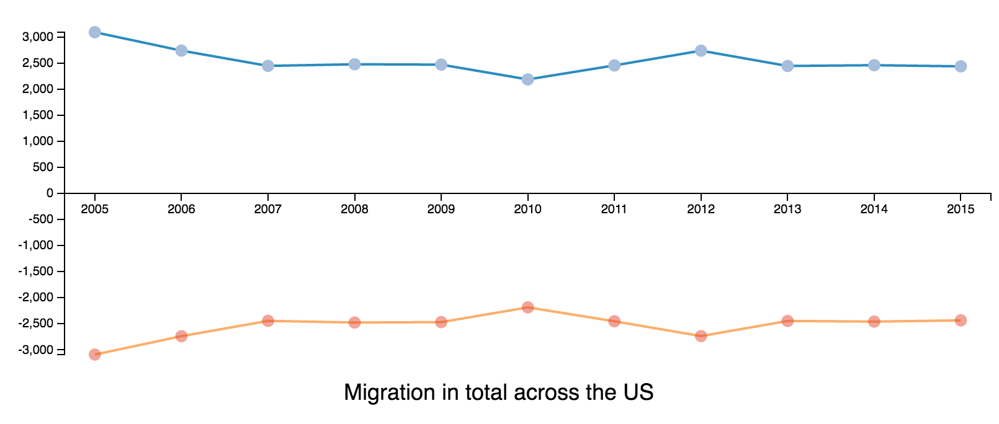
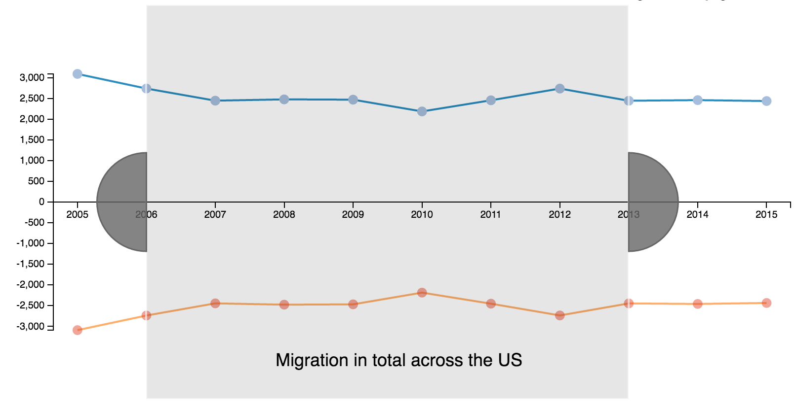
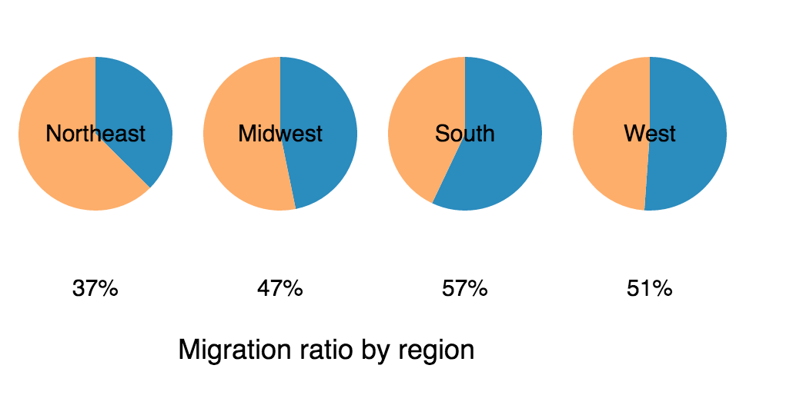
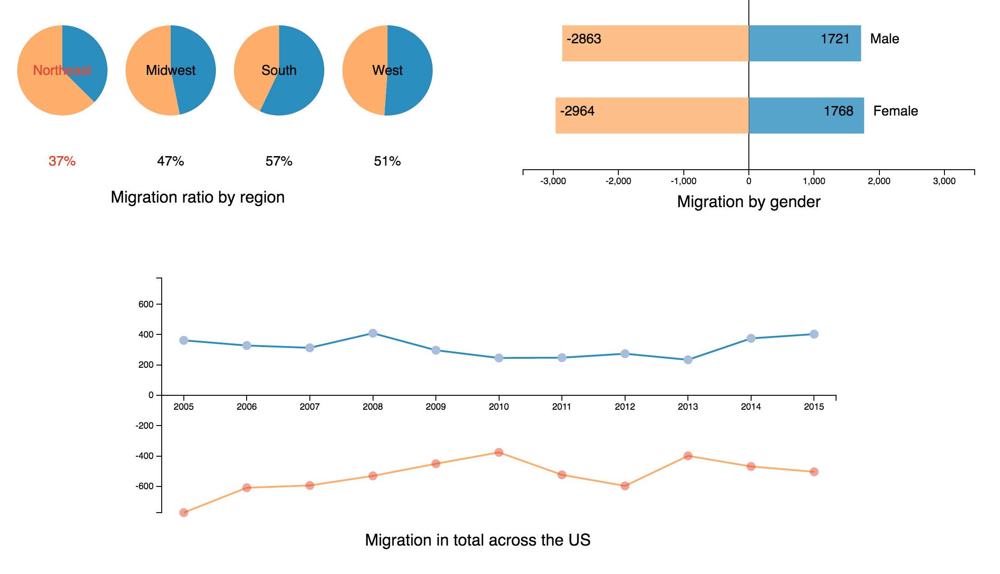
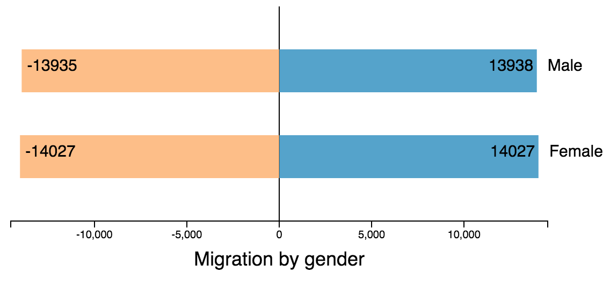
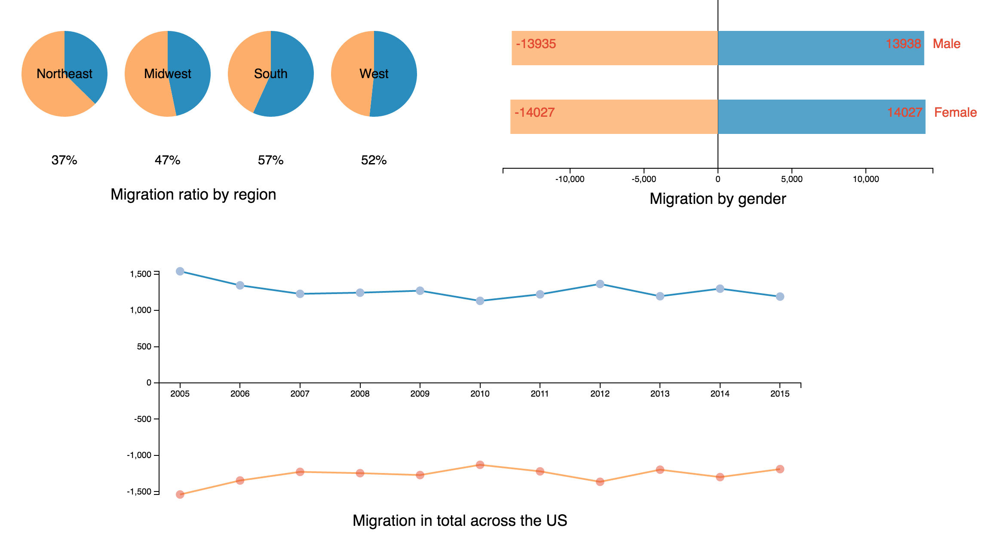

Visualizations and Multiple Views  
===

Link: [http://nzholmes.github.io/05-MapsAndViews/index.html](http://nzholmes.github.io/05-MapsAndViews/index.html)

Teams:
- Zheng Nie, nzholmes
- Yi Jiang, YiJiang93

Contribution of each team member:
- Zheng Nie makes line chart and horizontal chart, implements `d3.dispatch` to achieve smooth flow of information and intergrates three charts to be an organic whole.
- Yi Jiang makes pie chart, adjust colors and add introductory texts.

### Description of our visualization

We chose the migration in the United States from 2005 to 2015 as the topic of this assignment. Migration here is defined by the US census bureau as leaving and settle in a new place for more than a year. For example, a person can be counted as a immigrant at the end of 2015 if he moved in a year or more ago. We mainly look at three aspects about this topic: migration in total across the US, migration ratio by region and migration by gender, with each represented by line chart, pie chart and horizontal bar chart. 

**1. Migration in total across the US - Line chart**

   Line chart is composed of Year(2005-2015), the number of immigrants(line above x axis) and the number of emigrants(line below x axis). A brush is added to select period interval to examine the change in other two charts during the selected period. This chart shows the inflow and outflow every year basically cancels out, reflecting the stability of migration in the US.

**2. Migration ratio by region - Pie chart**

   Migration ratio is defined as the quotient of inflow and outflow. By default, the migration ratio in four regions - Northeast, Midwest, South, West - ranges from 2005 to 2015. The value in other periods can be achieved by selecting years in the line chart. Note that a mouseover on a specific region will lead to line chart and horizontal bar to present specific information about this region. This chart attests to the fact that southern region is usually the destination of migrants.

**3. Migration by gender - Horizontal bar**

   Generally speaking, the net flow of male and female stays at zero with small variation. A mousehover on particulat gender will relay this to the other two charts to make corresponding change about this gender.

### Technical achievements

- We adopt `d3.brush` in first chart to fulfill the function of year selection.
- `d3.dispatch` is used to realize the flow of selected data among these three charts. The key lies in the clear logic, otherwise charts will display information that is against common sense. We devote a large amount of time to it.

### Design achievements

- Harmonic colors across three charts. Steelblue and orange stands for inflow and outflow respectively.
- Negative number is used to describe outflow.
- Smooth transition.

